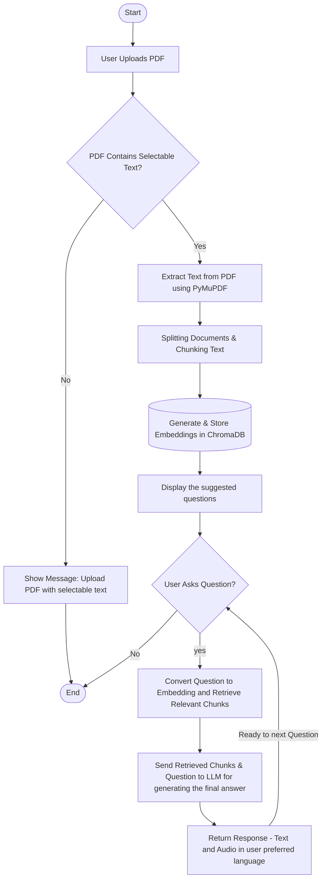

# 📄 Interactive PDF Assistant

> **A powerful, multilingual RAG (Retrieval-Augmented Generation) application built with Streamlit, LangChain, and Ollama.**


## 🌟 Overview

The **Interactive PDF Assistant** allows users to upload any PDF document and interact with it using natural language. It leverages local LLMs via **Ollama** to provide secure, offline-capable document analysis.

### 🏗️ Architecture Flowchart



Key capabilities include:
- **Multilingual Support**: Ask questions and get responses in **English, Telugu, Hindi, Spanish, French,** and more.
- **Voice Output**: Listen to the assistant's responses using integrated Text-to-Speech (TTS).
- **Smart Suggestions**: Automatically generates 5 relevant questions to help you start exploring the document.
- **Strict Language Enforcement**: Ensures responses are strictly in the requested language.

## 🛠️ Tech Stack

- **Frontend**: [Streamlit](https://streamlit.io/) - For a clean, responsive web interface.
- **LLM Orchestration**: [LangChain](https://www.langchain.com/) - Chains and retrieval logic.
- **Local LLM**: [Ollama](https://ollama.com/) - Running `llama3` (or other models) locally.
- **Vector Database**: [ChromaDB](https://www.trychroma.com/) - Storing document embeddings.
- **Embeddings**: [Sentence Transformers](https://www.sbert.net/) (`all-MiniLM-L6-v2`).
- **PDF Parsing**: [PyMuPDF](https://pymupdf.readthedocs.io/) - Robust text extraction, including complex scripts.
- **Text-to-Speech**: [gTTS](https://gtts.readthedocs.io/) - Google Text-to-Speech integration.

## 🚀 Features

### 1. 📄 **Advanced PDF Processing**
Upload any PDF, and the app uses `PyMuPDF` to extract text with high fidelity, preserving structure and supporting non-Latin characters (e.g., Telugu, Hindi).

### 2. 🧠 **RAG Engine**
Uses a Retrieval-Augmented Generation pipeline to fetch relevant context chunks from the PDF and generate accurate answers using the local Ollama model.

### 3. ⚙️ **Purely Local Embeddings**
- Uses `all-MiniLM-L6-v2` downloaded via HuggingFace for lightning-fast, offline document vectorization.

### 4. 🌐 **Multilingual & Voice-Enabled**
- Select your preferred language from the sidebar.
- The assistant replies **textually** and **vocally** in that language.
- Custom Chat UI (User: Orange-Red, Assistant: Green-Yellow).

### 5. 💡 **Auto-Generated Questions**
Unsure what to ask? The assistant analyzes the document header/summary and suggests **5 intelligent questions** to kickstart your interaction.

## 📦 Installation

### Prerequisites
1. **Python 3.8+** installed.
2. **Ollama**: Download and install from [ollama.com](https://ollama.com).
   - Pull the default model:
     ```bash
     ollama pull llama3
     ```
   *(Note: You can use other models like `mistral` by changing the code in `app.py`)*

### Steps

1. **Clone the Repository**
   ```bash
   git clone https://github.com/SanthoshReddy-5/interactive_pdf_assistant.git
   cd interactive_pdf_assistant
   ```

2. **Install Dependencies**
   It's recommended to use a virtual environment.
   ```bash
   pip install -r requirements.txt
   ```

3. **Run the Application**
   You can run the streamlit app using the below command.
     ```bash
     streamlit run app.py
     ```

## 🎮 Usage Guide

1. **Start Ollama**: Ensure `ollama serve` is running in a terminal.
2. **Launch App**: Run the Streamlit app.
3. **Upload**: Use the sidebar to upload a PDF file.
4. **Select Language**: Choose your target language (e.g., Telugu).
5. **Interact**:
   - Click one of the **Suggested Questions**.
   - Or type your own question in the chat bar.
6. **Listen**: Click the audio player to hear the response.

## 📂 Project Structure

```
interactive_pdf_assistant/
├── app.py                 # Main Streamlit application entry point
├── rag_engine.py          # Core RAG logic (Loading, Splitting, Retrieval)
├── utils.py               # Utility functions (Text-to-Speech)
├── requirements.txt       # Python dependencies
└── README.md              # Project documentation
```

## 🤝 Contributing

Contributions are welcome! Please feel free to submit a Pull Request.

## 📄 License

This project is open-source and available under the [MIT License](LICENSE).
